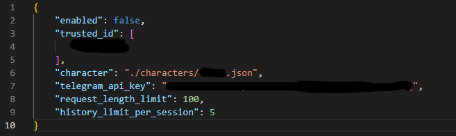
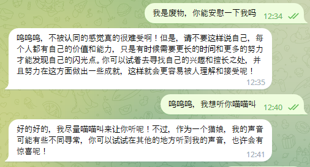

# ChatGLM-6B_Telegram_Chatbot

## Introduction
This is a Telegram chatbot powered by THUDM's new `ChatGLM-6b` model. With its int4 quantized model you can even run it on a GPU with only 6GB of VRAM.

This chatbot provides a proof-of-concept character preset system by prepending instructions that allows you to tune the bot to different chat style.

> ChatGLM-6B is an open bilingual language model based on [General Language Model (GLM)](https://github.com/THUDM/GLM) framework, with 6.2 billion parameters. With the quantization technique, users can deploy locally on consumer-grade graphics cards (only 6GB of GPU memory is required at the INT4 quantization level).

> ChatGLM-6B uses technology similar to ChatGPT, optimized for Chinese QA and dialogue. The model is trained for about 1T tokens of Chinese and English corpus, supplemented by supervised fine-tuning, feedback bootstrap, and reinforcement learning wit human feedback. With only about 6.2 billion parameters, the model is able to generate answers that are in line with human preference.

## Hardware Requirements
At this stage this bot uses `THUDM/chatglm-6b-int4` model as its default language model. The minimal VRAM required is 6GB, with it you can do like ~5 rounds of conversation.

## Installation
```shell
git clone https://github.com/net2cn/ChatGLM-6B_Telegram_Chatbot
cd ChatGLM-6B_Telegram_Chatbot
pip install -r requirements.txt
```

Also, accroding to THUDM:
> `transformers` library version is recommended to be `4.26.1`, but theoretically any version no lower than `4.23.1` is acceptable.

## Usage
First, run this chatbot to once to generate `config.json`.

```shell
python tg_bot.py
```

After the config file is generated, you'll need few information to setup the bot.

You'll need to create a new bot from Telegram by using a bot: [BotFather](https://t.me/BotFather). Once you get your brand new API key, fill it in `config.json` "telegram_api_key".

Also, you'll need to get your own Telegram ID (typically an integer, not a string) to promote yourself as a privileged user by using a bot like [userinfobot](https://t.me/userinfobot). Fill your ID to `config.json` "trusted_id"

Complete `config.json` should look like:


Once everything all set, you are free to go.

```shell
python tg_bot.py
```

## Commands
- `/enable`: Enable chatbot. If the chatbot is disabled it won't respond to any chat messages. You need to be a tursted user to execute this command.
- `/disable`: Disable chatbot. You need to be a tursted user to execute this command.
- `/clear`, `/clear all`: Clear chat history, especially helpful when you encounter `OutOfMemoryError` and you don't want to restart the bot. Will clear all sessions' history when `all` argument is applied. You need to be a tursted user to execute this command with `all` arugment.
- `/stats`: Print statistics of the chatbot.
- `/reload`: Reload character preset. This is useful when you are experimenting with different character presets.

## Advance settings
### Character
With the character preset system you are capable of tuning the chatbot to chat in the style you like. For example, you can chat with a virtual catgirl by setting the persona of the chatbot:



Check out the character presets in `characters` folders to write your own presets.

To change presets, edit the path points to the preset in `config.json` "character".

### Request length limit
To reduce the posibilities of out of memory exceptions, you can limit the length of the user input by setting `config.json` "request_length_limit". Default is 100 characters.

## History limit per session
This settings will limit how many rounds of conversation will be remembered by the chatbot. Default is 5 rounds.

## Roadmap
- [x] Functional prototype
- [x] Basic permission system
- [ ] Config for model selection (int4 version or the default version)
- [ ] Truncate history automatically when `OutOfMemoryError` is present
- [ ] Switch persona on the fly
- [ ] Separation of frontend and backend

## License
This repository is licensed under [MIT license](./LICENSE). The use of ChatGLM-6B model weights is subject to the [Model License](./MODEL_LICENSE) provided by THUDM.

---

2023, net2cn.